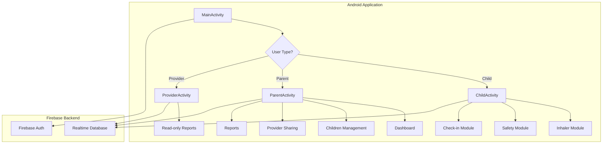
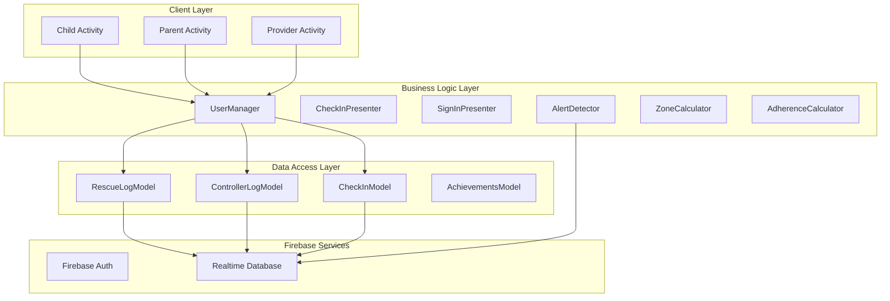
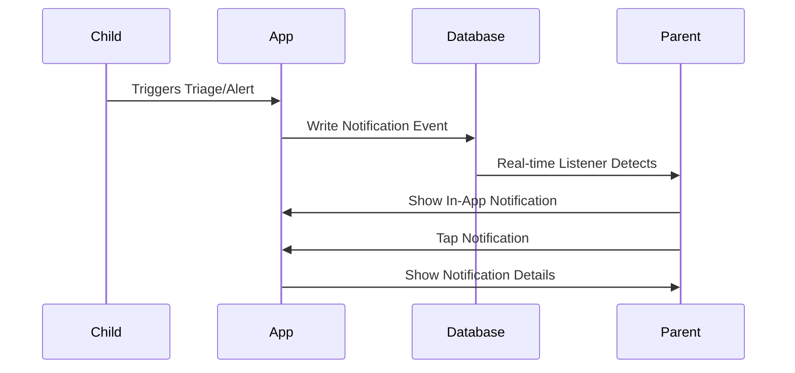
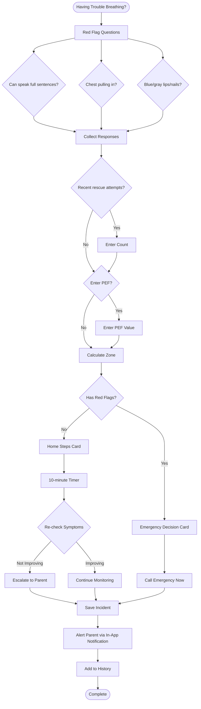

https://github.com/user-attachments/assets/45f2d167-c90f-4c8b-801f-6d81f0b773ce


A kid-friendly Android application designed to help children (ages 6-16) understand asthma, practice proper inhaler technique, log symptoms and medicine use, and share parent-approved information with healthcare providers via concise, exportable reports.

**Download the Application here:**
https://tinyurl.com/smart-air

## Table of Contents

- [Overview](#overview)
- [Architecture](#architecture)
- [User Roles & Features](#user-roles--features)
- [Technical Stack](#technical-stack)
- [Key Features](#key-features)
- [System Architecture Diagrams](#system-architecture-diagrams)
- [User Flows](#user-flows)
- [Data Models](#data-models)
- [Setup & Installation](#setup--installation)
- [Project Structure](#project-structure)
- [Firebase Configuration](#firebase-configuration)
- [Contributing](#contributing)
- [License](#license)
- [Acknowledgments and Contact](#acknowledgments-and-contact)

## Overview

SMART AIR is an Android application built with Java that provides a comprehensive asthma management solution for children, parents, and healthcare providers. The app emphasizes privacy, safety, and user-friendly design to help children manage their asthma effectively.

### Core Purpose

- **Education**: Help children understand asthma and proper inhaler technique
- **Tracking**: Log medicines, symptoms, triggers, and peak flow readings
- **Safety**: Provide triage guidance and emergency decision support
- **Sharing**: Enable parent-controlled data sharing with healthcare providers
- **Motivation**: Gamify medication adherence with streaks and badges

## Architecture

### System Architecture



### User Role Architecture


## User Roles & Features

### 1. Child User

**Access Methods:**
- Independent account with email/password
- Child profile under parent account (username/password, no email)

**Key Features:**
- Log rescue and controller medications
- Practice inhaler technique with step-by-step guidance and video
- Enter peak flow (PEF) readings
- Daily check-in for symptoms and triggers
- View current asthma zone (Green/Yellow/Red)
- Access triage tool for breathing difficulties
- Track streaks and earn badges
- View medication history

**Privacy:**
- Sees only their own data
- Cannot access other children's information

### 2. Parent User

**Key Features:**
- Manage multiple children
- View dashboard with real-time status for each child
- Receive in-app notifications for:
  - Red zone days
  - Rapid rescue repeats (≥3 in 3 hours)
  - Triage escalations
  - Inventory alerts
- Set personal best (PB) for each child
- Configure controller medication schedule
- Manage inhaler inventory
- Control granular sharing permissions per child
- Generate and share provider reports (PDF/CSV)
- Create and manage provider invite codes

**Privacy Controls:**
- Granular toggles for each data type per child
- Real-time permission updates
- Reversible sharing at any time

### 3. Provider User (Read-Only)

**Access:**
- One-time invite code/link (expires in 7 days)
- Can be revoked by parent at any time

**Key Features:**
- View shared data based on parent permissions
- Access provider reports with charts and statistics
- Read-only access to:
  - Rescue logs (if enabled)
  - Controller adherence summary (if enabled)
  - Symptoms (if enabled)
  - Triggers (if enabled)
  - Peak flow (PEF) (if enabled)
  - Triage incidents (if enabled)
  - Summary charts (if enabled)

## Technical Stack

### Development Environment
- **Language**: Java 11
- **Build System**: Gradle (AGP 8.12.3)
- **Build Scripts**: Kotlin DSL (build.gradle.kts)
- **IDE**: Android Studio
- **Version Control**: Git

### Platform & SDK
- **Platform**: Android
- **Minimum SDK**: 24 (Android 7.0 Nougat)
- **Target SDK**: 36 (Android 15)
- **Compile SDK**: 36
- **Package Name**: com.example.myapplication

### Architecture & Design Patterns
- **Architecture Pattern**: MVP (Model-View-Presenter)
- **UI Binding**: ViewBinding (enabled)
- **Build Config**: BuildConfig fields for Firebase configuration

### UI Framework & Components
- **Material Design**: Android Material Components 1.13.0
- **AppCompat**: AndroidX AppCompat 1.7.1
- **Layout**: ConstraintLayout 2.2.1
- **Navigation**: ViewPager2 1.1.0 (for onboarding)
- **Lists**: RecyclerView 1.4.0
- **Fragments**: AndroidX Fragment 1.8.9
- **Activities**: AndroidX Activity 1.11.0

### Backend Services
- **Authentication**: Firebase Authentication (via Firebase BOM 34.5.0)
- **Database**: Firebase Realtime Database
- **Crash Reporting**: Firebase Crashlytics 20.0.3
- **Initialization**: Custom FirebaseOptions configuration (no google-services.json)

### Third-Party Libraries
- **Charts**: MPAndroidChart v3.1.0
  - Line charts for PEF trends
  - Bar charts for zone distribution and rescue frequency
  - Pie charts (legacy, replaced with bar charts)
- **Calendar**: Material Calendar View 1.9.2
  - Date selection for reports and filters
  - Date picker dialogs

### PDF Generation
- **Library**: Android's native PdfDocument API
- **Rendering**: PdfRenderer for PDF viewing
- **Export Format**: PDF and CSV for provider reports
- **Storage**: Android File System (External Files Directory)

### Testing
- **Unit Testing**: JUnit 4.13.2
- **Android Testing**: AndroidX Test Ext JUnit 1.3.0
- **UI Testing**: Espresso 3.7.0
- **Mocking**: Mockito 5.1.1 / 5.11.0

### Key Dependencies
```gradle
// Firebase
implementation(platform("com.google.firebase:firebase-bom:34.5.0"))
implementation("com.google.firebase:firebase-auth")
implementation("com.google.firebase:firebase-database")
implementation("com.google.firebase:firebase-crashlytics")

// UI Components
implementation("com.google.android.material:material:1.13.0")
implementation("androidx.appcompat:appcompat:1.7.1")
implementation("androidx.constraintlayout:constraintlayout:2.2.1")
implementation("androidx.viewpager2:viewpager2:1.1.0")
implementation("androidx.recyclerview:recyclerview:1.4.0")
implementation("androidx.fragment:fragment:1.8.9")
implementation("androidx.activity:activity:1.11.0")

// Third-Party
implementation("com.github.PhilJay:MPAndroidChart:v3.1.0")
implementation("com.applandeo:material-calendar-view:1.9.2")

// Testing
testImplementation("junit:junit:4.13.2")
testImplementation("org.mockito:mockito-core:5.1.1")
androidTestImplementation("androidx.test.ext:junit:1.3.0")
androidTestImplementation("androidx.test.espresso:espresso-core:3.7.0")
```

### Build Configuration
- **Signing**: Release keystore support (RSA 2048-bit)
- **ProGuard**: Disabled (minifyEnabled = false)
- **APK Output**: Custom filename "SMART AIR.apk" for release builds

## Key Features

### R1: Accounts, Roles & Onboarding


**Implementation:**
- Email/password authentication for Parent and Provider
- Username/password for Child profiles
- Role-based routing (`MainActivity` → `ChildActivity` / `ParentActivity` / `ProviderActivity`)
- First-time onboarding flow (`OnBoardingActivity`)
- Protected screens with authentication checks

### R2: Parent/Child Linking & Selective Sharing


**Implementation:**
- `Permission` class with 7 boolean flags
- `ProvidersFragment` for managing permissions
- `InvitationCreateActivity` for generating invite codes
- `InvitationAcceptActivity` for provider acceptance
- Real-time permission updates in database

### R3: Medicines, Technique & Motivation


**Implementation:**
- `RescueLog` and `ControllerLog` models
- `ChildInhalerInstructions` with step-by-step guidance
- `ChildInhalerVideo` with embedded video
- `ChildInhalerUse` for medication logging
- `Achievement` class for streaks and badges
- `ControllerSchedule` for adherence tracking

**Badges:**
1. First perfect controller week (7 consecutive scheduled days)
2. 10 high-quality technique sessions
3. Low rescue month (≤4 rescue days in 30 days)

### R4: Safety & Control (PEF, Zones & Triage)


**Implementation:**
- `ZoneCalculator` for zone calculation
- `PEFEntryActivity` for PEF input
- `TriageActivity` with multi-step flow
- `TriageSession` and `TriageIncident` models
- `AlertDetector` for safety alerts
- `NotificationManager` for in-app notifications

**Zone Thresholds:**
- Green: ≥80% of Personal Best
- Yellow: 50-79% of Personal Best
- Red: <50% of Personal Best

### R5: Symptoms, Triggers & History


**Implementation:**
- `CheckInView` for daily entry
- `CheckInEntry` model
- `FilterCheckInByDate` and `FilterCheckInBySymptoms` for filtering
- `ViewCheckInHistory` for browsing history
- `ProviderReportGeneratorActivity` for PDF/CSV export

### R6: Parent Home, Notifications & Provider Report


**Implementation:**
- `DashboardFragment` with real-time statistics
- `TrendSnippetActivity` with chart visualization
- `ProviderReportGeneratorActivity` for PDF generation
- `NotificationManager` and `AlertDetector` for in-app alerts
- `ChartComponent` for data visualization

**Report Contents:**
- Rescue frequency
- Controller adherence percentage
- Symptom burden counts
- Zone distribution over time
- Notable triage incidents
- Time-series charts (PEF trend)
- Categorical charts (zone distribution, rescue frequency)

## System Architecture Diagrams

### Data Flow Architecture



### Notification Flow



## User Flows

### Child Medication Logging Flow


### Triage Flow



### Provider Sharing Flow


## Data Models

### Core User Models


### Medication & Logging Models


### Safety & Triage Models


### Check-in & Reporting Models


## Setup & Installation

### Prerequisites

- Android Studio (latest version)
- JDK 11 or higher
- Android SDK (minSdk 24, targetSdk 36)
- Firebase project with:
  - Authentication enabled
  - Realtime Database enabled

### Installation Steps

1. **Clone the repository**
   ```bash
   git clone https://github.com/billy-enrizky/Smart-AIR/
   cd Smart-AIR
   ```

2. **Configure Firebase**
   - Configure Firebase project settings as needed

3. **Install dependencies**
   ```bash
   ./gradlew build
   ```

4. **Build and run**
   - Open project in Android Studio
   - Sync Gradle files
   - Run on emulator or physical device

### Firebase Configuration

The app requires the following Firebase services:

1. **Authentication**
   - Email/Password provider enabled
   - User management in Firebase Console

2. **Realtime Database**
   - Security rules configured in `database.rules.json`
   - Structure: `/users/{userId}/...`
   - In-app notifications stored at `users/{parentId}/notifications/{notificationId}`

## Project Structure

```
CSCB07Project/
├── app/
│   ├── src/
│   │   ├── main/
│   │   │   ├── java/com/example/myapplication/
│   │   │   │   ├── achievements/          # Streaks and badges
│   │   │   │   ├── auth/                  # Authentication
│   │   │   │   ├── charts/                # Chart components
│   │   │   │   ├── childmanaging/         # Child profile management
│   │   │   │   ├── core/                  # Core utilities (UserManager)
│   │   │   │   ├── dailycheckin/          # Daily check-in feature
│   │   │   │   ├── home/                  # Home activities (Parent, Child)
│   │   │   │   ├── inhaler/               # Inhaler technique and logging
│   │   │   │   ├── medication/            # Medication schedules
│   │   │   │   ├── notifications/          # Push notifications
│   │   │   │   ├── onboarding/            # First-time user onboarding
│   │   │   │   ├── providermanaging/      # Provider invite system
│   │   │   │   ├── providers/             # Provider read-only views
│   │   │   │   ├── reports/               # Report generation
│   │   │   │   ├── safety/                # Triage and PEF
│   │   │   │   ├── SignIn/                # Sign-in MVP
│   │   │   │   ├── userdata/              # User account models
│   │   │   │   └── utils/                 # Utility classes
│   │   │   ├── res/                       # Resources (layouts, drawables)
│   │   │   └── AndroidManifest.xml
│   │   └── test/                          # Unit tests
│   ├── build.gradle.kts
├── build.gradle.kts
├── firebase.json
├── database.rules.json
└── README.md
```

## Firebase Configuration

### Database Structure

```
/users/
  /{parentId}/
    /children/
      /{childId}/
        /pefReadings/
        /incidents/
        /rescueUsage/
        /history/
    /notifications/
      /{notificationId}/
    /inviteCode
  /{providerId}/
    /LinkedParentsId

/CheckInManager/
  /{childId}/
    /{date}/

/RescueLogManager/
  /{childId}/
    /{timestamp}/

/ControllerLogManager/
  /{childId}/
    /{timestamp}/

/notifications/
  /{parentId}/
    /{notificationId}/
```

### Security Rules

The database uses Firebase Realtime Database security rules:
- Users can only read/write their own data
- Children data is readable by authenticated users (for provider access)
- Notifications can be written by authenticated users
- Notifications are only readable by the parent

## Key Components

### UserManager
Central singleton for managing current user state and Firebase instances.

### ZoneCalculator
Calculates asthma zones (Green/Yellow/Red) based on PEF and Personal Best.

### AlertDetector
Detects safety conditions and triggers notifications:
- Red zone days
- Rapid rescue repeats
- Worse after dose
- Triage escalations

### NotificationManager
Manages in-app notifications stored in Firebase Realtime Database for parents.

### ChartComponent
Shared component for generating charts (line, bar, pie) used in reports and dashboards.

### AdherenceCalculator
Calculates controller medication adherence percentage based on schedule and logs.

## Contributing

1. Follow the existing code structure and patterns
2. Use MVP architecture for new features
3. Ensure all database operations use Firebase Realtime Database
4. Add appropriate error handling and logging
5. Update documentation for new features
6. Test on multiple Android versions (API 24+)

## License

MIT License.


**Disclaimer**: This project was initially completed as part of [CSCB07H3](https://utsc.calendar.utoronto.ca/course/cscb07h3) Project at the University of Toronto Scarborough. We encourage the community not to reuse it for assignments, submissions, or any inappropriate purposes.


##  Acknowledgments and Contact

- billy.suharno@mail.utoronto.ca (Muhammad Enrizky Brillian)
- pe.zhao@mail.utoronto.ca (Yipeng Zhao)
- kingsleyy.chan@mail.utoronto.ca (Kingsley Chan)
- terry.gao@mail.utoronto.ca (Terry Gao)
- minhanh.dong@mail.utoronto.ca (Minh Anh Dong Nguyen)

